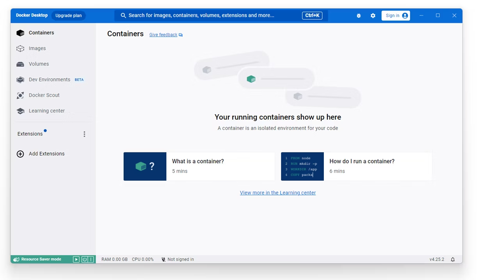

# Entrion

# 環境構築

## Git関連
https://hackmd.io/@22s-kcctfes/BkKw5gDnR

これを見て環境構築とGitの理解を深めていただきたい。

## Docker

コマンドプロンプトや各種ターミナルで`docker`コマンドが使える方は飛ばしてOK.

### Dockerのインストール

#### Windows

[Docker Desktop for Windows](https://www.docker.com/get-started/)をインストール

1. exeファイルを起動しインストーラに従ってインストール
(WSL2を使う設定にしておく) (自動起動してうざいと言う人は、Docker Desktopの設定から自動起動をオフにしてください。)
2. Docker Desktopを起動
3. Sign Upを行う
4. この画像が出たらOK
5. dockerコマンドが使えることが確認できれば成功

#### Mac

0. Homebrewをインストール
```
$ /bin/bash -c "$(curl -fsSL https://raw.githubusercontent.com/Homebrew/install/HEAD/install.sh)"
```
1. Dockerをインストール
```
$ brew install docker
```
2.  Docker Desktopを起動
3. Sign Upを行う
4. この画像が出たらOK
5. dockerコマンドが使えることが確認できれば成功

## リポジトリのクローン
```
$ git clone git@github.com:Hayatann/Entrion.git
```

## 起動

1. 何らかの方法で共有された`.env`ファイルをプロジェクトのルートディレクトリに配置
2. プロジェクトのディレクトリに移動
3. Docker composeで開発用サーバーを起動
```shell
$ docker-compose up --build
```
4. ブラウザで`localhost:3000`にアクセス
5. 画面が表示されれば成功

